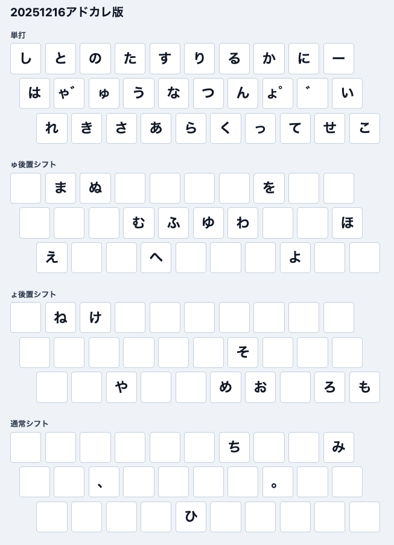

# 葉月配列

オレオレ月配列です（WIP）

## 配列図

## 設計思想

- 主にJISキーボードでの使用を想定する。
- 3行10列の30キーに収める。
- 普段使いとタイピングゲームでの使用の両方を想定する。
- 濁音同置、半濁音同置、拗音同置、外来音同置でシンプルで覚えやすい配列にする。

## 導入方法

Google日本語入力のローマ字テーブルで実装しています。

[葉月配列 20251216アドカレ版](./data/implementation/haduki-2025-12-16-adcale.tsv)

## 入力方法

### 基本の入力方法

ゃゅょ゛の4キーを後置シフト、Shiftキーを通常のシフトとして使います。具体的な入力方法は、次の通りです。

- 単打に書かれているかなは、キーをそのまま押して入力します。
- ゅ後置シフトのかなは、キーを押したあとに「ゅ」キーを押して入力します。
- ょ後置シフトのかなは、キーを押したあとに「ょ」キーを押して入力します。
- 拗音は、かなを入力してから「ゃ」「ゅ」「ょ」キーを押して入力します。
- 濁音は、かなを入力してから「ゃ」キーまたは「゛」キーを押して入力します。
- 半濁音は、かなを入力してから「ょ」キーを押して入力します。
- 外来音に使う母音の小書きは、Shiftキーを押しながら母音のかなを入力します。

### シフトの省略

拗音、濁音、半濁音、外来音の入力で後置シフトに配置されているかなを使う場合は、シフトを省略して入力します。

| 種類                   | 例                                            |
| ---------------------- | --------------------------------------------- |
| 拗音のShiftキー省略    | Shift + る(u) = ち のとき、る(u) + ゃ = ちゃ  |
| 濁音の後置シフト省略   | い(;) + ゅ(d) = ほ のとき、い(;) + ゛(l) = ぼ |
| 半濁音の後置シフト省略 | い(;) + ゅ(d) = ほ のとき、い(;) + ゜(k) = ぽ |
| 外来音の後置シフト省略 | な(g) + ゅ(d) = ふ のとき、Shift + な(g) = ふ |

### 例外など

入力方法について、いくつかの例外があります。

- 濁音にも拗音にもなるかな（「き」「し」「ち」「ひ」）を濁音化する場合は、「゛」キーを使用します。
- 「ぴ」は「ひ」+「ょ」で入力できないため、代わりに「は」+「ゅ」で入力します。
- 単打ではないイ段かな（「ひ」「み」「り」）を単体で入力する場合は、通常のシフトを使います。

Shiftキーを押すタイミングは、ある程度融通が効くようになっています。Shiftキーの面の空いている箇所は、単打と同じキーが配置されているからです。例えば「てぃ」は、「て + Shift(い)」の他に「Shift(て + い)」でも入力できます。

## 今後の課題

- 打鍵モデルを改善する
- 定量評価と、他の配列との比較を行う
- n-gramデータセットを追加する
- 配列の探索アルゴリズムを改善する
- 各OSの配列変更ソフトで実装する

## 参考にした配列

- [月見草配列](https://mentaiko.syoyu.net/tsukimisou): ゃゅょを後置シフトキーと併用するアイデアを参考にしました。
- [月林檎配列](https://menmentsu.hateblo.jp/entry/2021/01/12/230614): 濁音の後置シフト省略を参考にしました。
- [薙刀式](http://oookaworks.seesaa.net/article/456099128.html#gsc.tab=0): 清・濁・半濁・拗・外来音同置のシフト機構を参考にしました。
- [文月配列](https://x.com/CordialBun/status/1974436234165625290): 濁音を2キー配置するアイデアと、配列の命名を参考にしました。
